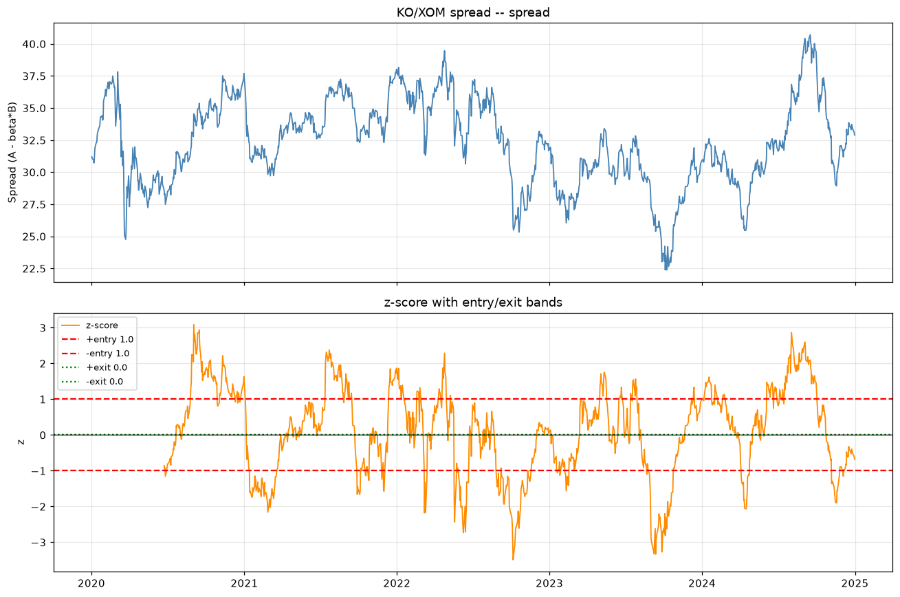
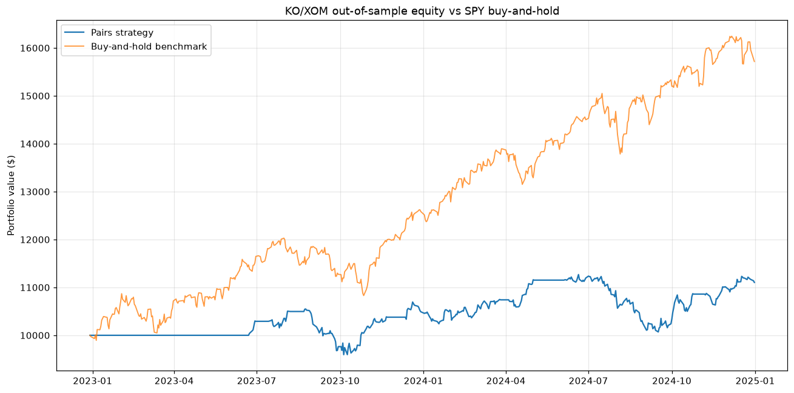

# Statistical Arbitrage (Pairs Trading) Research Platform

A Python research platform that identifies pairs of historically related stocks,
validates that their relationship is *statistically* mean-reverting (not just
correlated), generates trading signals from deviations in their spread, and
evaluates the strategy through an event-driven backtester with realistic
transaction costs, parameter optimization, and out-of-sample validation.

A companion **Kalshi mispricing module** (`kalshi/`) provides a read-only
client for Kalshi's public prediction-market API plus locked-in-edge detection
(complementary yes/no prices, cross-market event arbitrage).

## Strategy in brief

1. **Pair identification** (`src/pairs_trading/pairs.py`) — for every candidate
   pair: Pearson correlation, OLS hedge ratio β (statsmodels), the
   **Engle-Granger cointegration test** (`statsmodels.tsa.stattools.coint`),
   and the half-life of mean reversion from the regression
   Δspread = λ·spread₋₁ (half-life = −ln 2 / λ). A pair is traded only if it
   passes *all three* filters: high correlation **and** p < 0.05 **and**
   0 < half-life < 252 days. Pairs that are merely correlated are rejected.
2. **Signal generation** (`signals.py`) — spread `S = A − β·B`, rolling
   z-score `(S − rolling_mean) / rolling_std`, then a state machine:
   enter long/short when |z| > entry threshold, exit when |z| < exit
   threshold or z crosses 0. Signals at bar *t* use only data through bar *t*
   and are executed at that close — **no look-ahead bias**.
3. **Backtesting** (`backtest.py`) — explicit bar-by-bar event loop tracking
   cash and share positions (long 1×A / short β×B per spread contract), so
   equity accounting is exact: with no trade, Δequity = position × Δspread.
   Costs (5 bps commission + 2 bps slippage per side by default) are charged
   once per position change; a flip costs twice (close + open).
4. **Optimization** (`optimize.py`) — grid search over
   window × entry_z × exit_z (8 × 5 × 4 = **160 combinations**) ranked by
   **in-sample Sharpe**, then evaluated once on a held-out test slice. A
   large train/test Sharpe divergence raises an overfitting flag, and
   `baseline_vs_optimized` replays a fixed textbook configuration
   (window 30, entry 2.0, exit 0.5) on the test slice so the Sharpe
   improvement is measured, not assumed.
5. **Metrics** (`metrics.py`) — Sharpe (√252 annualized, 0.0 on zero
   volatility), max drawdown from the running peak, CAGR, win rate on
   completed round trips, cumulative returns.
6. **Signal-quality measurement** (`quality.py`) — replays a naive
   correlation-only screen against the full
   (correlation + cointegration + half-life) filter and reports the share
   of naive entry signals suppressed, plus the reduction in losing round
   trips.
7. **Intraday stage** (`intraday.py`) — 1-minute bars for an 80-ticker
   universe (7,800 bars × 80 tickers = 624,000 observations), correlation
   pre-screen, then the full
   cointegration check on the top candidates. yfinance caps 1-minute bars
   at the last ~30 days and ~8 days per request, so the window is walked
   in 8-day chunks.
8. **Custom datasets** (`datasets.py`) — bring your own price data in
   long CSV (`datetime, symbol, close`), wide CSV (`datetime, AAA, BBB,
   ...`), or one-CSV-per-ticker directory layouts; every loader validates
   and normalizes to the same aligned panel the platform runs on. A seeded
   synthetic 1-minute generator is included for offline scale testing
   (clearly labeled synthetic — never presented as real data).

## Results (real run, 2020-01-01 → 2025-01-01, $10k, 5 bps + 2 bps per side)

Pair screening on KO, PEP, XOM, CVX (1,258 trading days):

| pair | corr | β | coint p | half-life (d) | selected |
|------|------|---|---------|---------------|----------|
| KO/PEP | 0.897 | 0.34 | 0.577 | 97.3 | ❌ (correlated but not cointegrated) |
| KO/XOM | 0.894 | 0.23 | 0.015 | 41.2 | ✅ |
| KO/CVX | 0.860 | 0.19 | 0.079 | 52.7 | ❌ |
| PEP/XOM | 0.908 | 0.61 | 0.019 | 29.1 | ✅ |
| PEP/CVX | 0.911 | 0.54 | 0.003 | 25.3 | ✅ |
| XOM/CVX | 0.958 | 0.85 | 0.386 | 106.1 | ❌ (highest correlation — still rejected) |

Out-of-sample performance of the winning parameters (train 60% / test 40%,
8 × 5 × 4 = 160 combinations searched per pair):

| pair | window | entry_z | exit_z | train Sharpe | **test Sharpe** | test ann. return | test max DD | test win rate | test trades | overfit? | Sharpe gain vs untuned baseline |
|------|--------|---------|--------|--------------|-----------------|------------------|-------------|---------------|-------------|----------|---------------------------------|
| CVX/PEP | 30 | 2.0 | 0.25 | 1.278 | **−0.178** | −1.9% | −10.4% | 0.583 | 12 | ⚠️ yes | −0.045 |
| KO/XOM | 120 | 1.0 | 0.0 | 1.080 | **0.649** | +5.4% | −10.6% | 0.714 | 7 | no | **+1.209** |
| PEP/XOM | 30 | 3.0 | 0.25 | 1.391 | **0.470** | +1.9% | −3.6% | 1.000 | 3 | no | +0.584 |

The "Sharpe gain" column replays a fixed textbook configuration (window 30,
entry 2.0, exit 0.5) on the same test slice — tuning beats the untuned
baseline by up to **+1.21** in test Sharpe.

Signal-quality measurement (naive correlation-only screen vs the full
cointegration filter, same universe): the naive screen produced 219 entry
signals across 6 pairs with 85 losing round trips; the full filter kept 3
pairs, 111 signals, 42 losing round trips — suppressing **49.3%** of the
naive signals and cutting losing round trips by **50.6%**.

Intraday stage: 1-minute bars for an 80-ticker universe over the last 30
days — **7,800 bars × 80 tickers = 624,000 (bar, ticker) observations** —
correlation pre-screened, then the full cointegration check on the top
candidates (e.g. GOOGL/GOOG, DUK/SO and HD/LOW selected; XOM/CVX and
V/MA rejected on cointegration).




## Setup

```bash
cd pairs-trading-platform
python3 -m venv .venv          # project-local venv (system pip is externally managed)
.venv/bin/pip install -r requirements.txt
```

(A virtualenv is used because the system Python is PEP-668 externally
managed; user-level installs would also work.)

## Usage

```bash
# Run the test suite (88 tests, all synthetic/seeded — no network needed)
.venv/bin/python -m pytest tests/ -v

# Run the full pipeline on real market data (downloads via yfinance)
.venv/bin/python scripts/run_pipeline.py
# -> outputs/summary.csv, outputs/spread_*.png, outputs/equity_*.png,
#    outputs/resume_metrics.json

# Run on your own dataset instead of yfinance (long / wide / dir layouts)
.venv/bin/python scripts/run_pipeline.py \
    --data csv --data-path my_prices.csv --data-format long

# Custom intraday data (e.g. your own tick/minute bars for the 500k+ scale)
.venv/bin/python scripts/run_pipeline.py \
    --intraday-data csv --intraday-path my_minutes.csv --intraday-format long
```

See `src/pairs_trading/datasets.py` for the accepted CSV layouts, or
generate a small example file:

```bash
.venv/bin/python -c "
import sys; sys.path.insert(0, 'src')
from pairs_trading import datasets
datasets.write_example_long_csv('example_prices.csv')"
```

## Project layout

```
pairs-trading-platform/
├── README.md
├── requirements.txt
├── scripts/
│   └── run_pipeline.py      # end-to-end: fetch -> pairs -> grid search -> backtest -> plots
├── src/pairs_trading/
│   ├── data.py              # yfinance fetch, calendar alignment, ffill, returns
│   ├── datasets.py          # custom CSV datasets (long/wide/dir) + validation + synthetic 1m generator
│   ├── intraday.py          # 1-minute bar ingestion (chunked), observation counting, correlation pre-screen
│   ├── quality.py           # naive vs filtered screen: false-signal suppression measurement
│   ├── pairs.py             # correlation, OLS hedge ratio, Engle-Granger, half-life
│   ├── signals.py           # spread, rolling z-score, entry/exit state machine
│   ├── backtest.py          # event-driven bar-by-bar backtester (cash + shares)
│   ├── costs.py             # bps commission + slippage model
│   ├── metrics.py           # Sharpe, drawdown, CAGR, win rate
│   ├── optimize.py          # grid search with train/test split + overfit flag
│   └── visualize.py         # spread/z-band and equity-vs-benchmark plots
├── kalshi/
│   ├── client.py            # read-only Kalshi trade-api v2 client (public endpoints)
│   └── mispricing.py        # yes/no complement arb + cross-market event arb detection
├── tests/                   # pytest suite (see below)
└── outputs/                 # pipeline artifacts (CSVs, PNGs)
```

## Testing

88 tests, all passing (`python -m pytest tests/ -v`). Highlights:

- **No look-ahead**: a signal at bar *t* leaves equity at *t* untouched; the
  position earns only from *t+1*.
- **Exact accounting**: whenever the position is unchanged, equity change
  equals position × spread change, to the cent; costs are deducted exactly
  once per position change (a flip = close + open = 2 charges).
- **β recovery**: OLS recovers the true β=2.5 on a seeded cointegrated pair.
- **Cointegration**: accepts a truly cointegrated pair (p < 0.05), rejects two
  independent random walks.
- **Optimizer**: the reported winner is verified to be the genuine argmax of
  in-sample Sharpe, and test metrics are recomputed independently on the
  held-out slice.
- **Intraday chunking**: yfinance calls are verified to stay within the
  8-day-per-request cap, the 1-minute lookback clamps to 30 days, and every
  batch stays within the size limit.
- **Custom datasets**: long/wide/directory CSV layouts round-trip to the
  same aligned panel; validation rejects duplicate timestamps, bad
  datetimes, and non-numeric prices with clear errors; the synthetic
  1-minute generator is seeded and reproducible.
- **Kalshi**: all tests use mocked responses (no network); the client
  endpoints and response shapes were verified live against the real API.

## Kalshi module

`kalshi/client.py` wraps the public endpoints (base
`https://api.elections.kalshi.com/trade-api/v2`, verified live 2026-09-26):
`GET /markets`, `GET /markets/{ticker}`, `GET /markets/{ticker}/orderbook`
(live shape: `{"orderbook_fp": {"yes_dollars": [...], "no_dollars": [...]}}`),
`GET /events`. `kalshi/mispricing.py` flags (a) markets where
yes_ask + no_ask < 100¢ (buy both) or yes_bid + no_bid > 100¢ (sell both),
and (b) events whose mutually-exclusive markets sum away from 100¢.
**Read-only analysis only — no order placement, no real-money trading.**

## Limitations (honest)

- **Fill-at-close assumption**: trades execute at the closing price with no
  market impact; real fills differ, especially at larger size.
- **Survivorship/selection bias**: pairs are picked from today's large-cap
  tickers; delisted or distressed names never enter the screen.
- **Regime change**: cointegration is estimated on history — the KO/XOM
  train/test collapse is a live example of a relationship breaking down.
- **Daily bars only (default run)**: the backtest runs on daily bars, so
  intraday mean reversion and overnight gaps are invisible to it. A
  separate intraday stage processes 1-minute bars (yfinance serves ~30
  days) for pair screening at 500k+ observation scale; your own
  tick/minute data can be fed in via `--intraday-data csv`.
- **No borrow costs**: shorting β shares of B is assumed frictionless beyond
  the bps cost model; hard-to-borrow names would cost more.
- **Look-ahead in pair selection**: the screen uses the full sample; a
  production system would re-screen on rolling windows.
